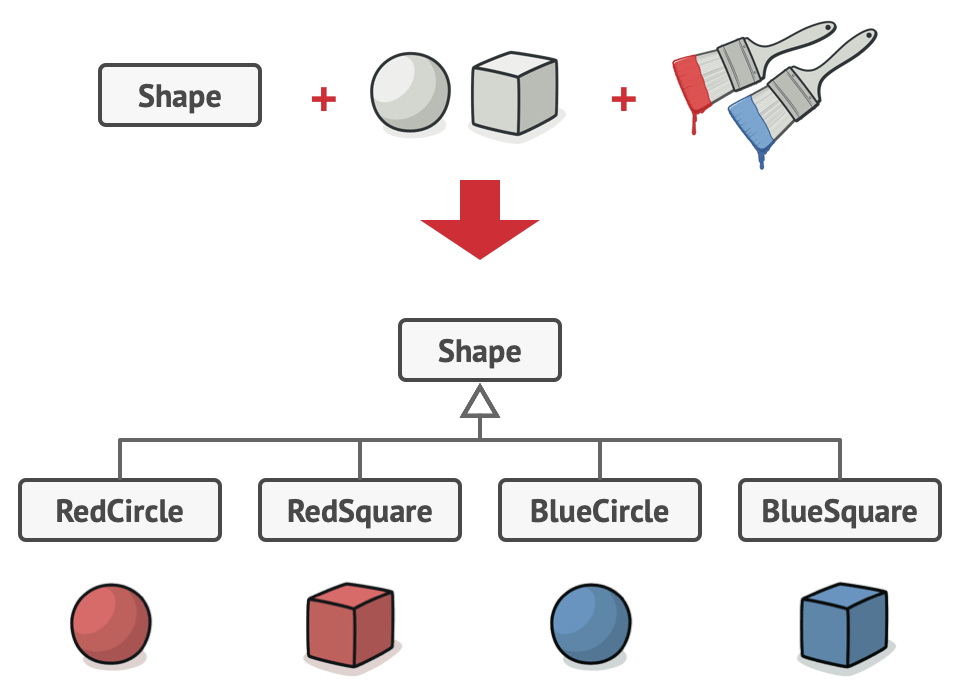
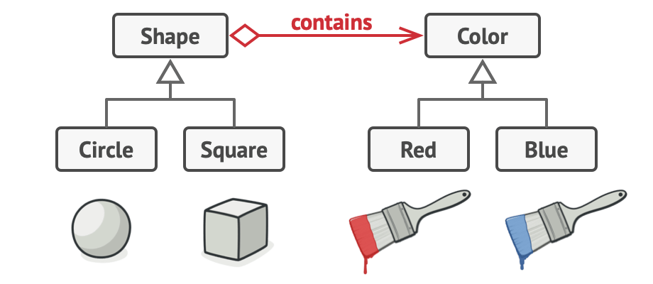

# Problem

- If we have shapes and colors and need to get them mixed , the first approch is to make class in the following format {Color+Shape} like RedCircle
- But if we need to add a new shape or anew color this means that classes will grow  exponentially

# Solution

- The problem occurs because we're trying to extend the classes into 2 independent directions (Color and shape)

- Bridge Pattern solves this problem by switching inheritance to composition so we will extract one of the dimention into a separate class hirearchy 

